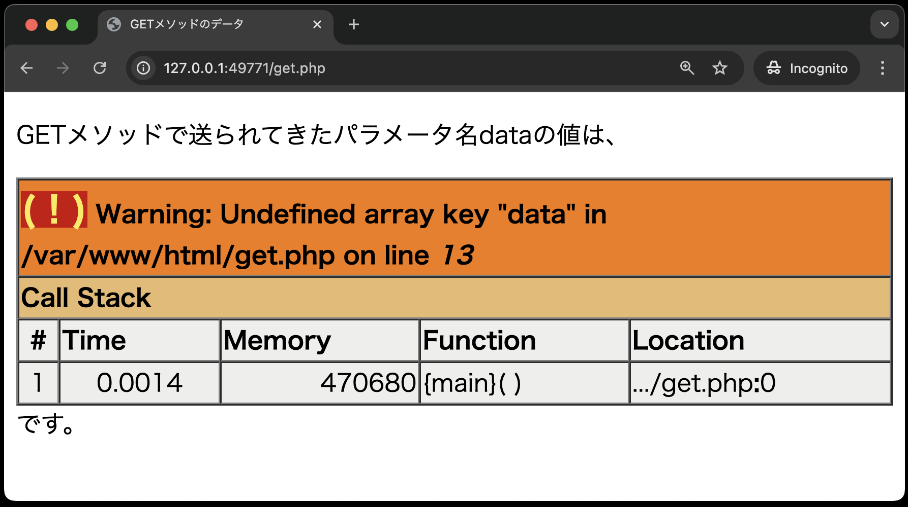
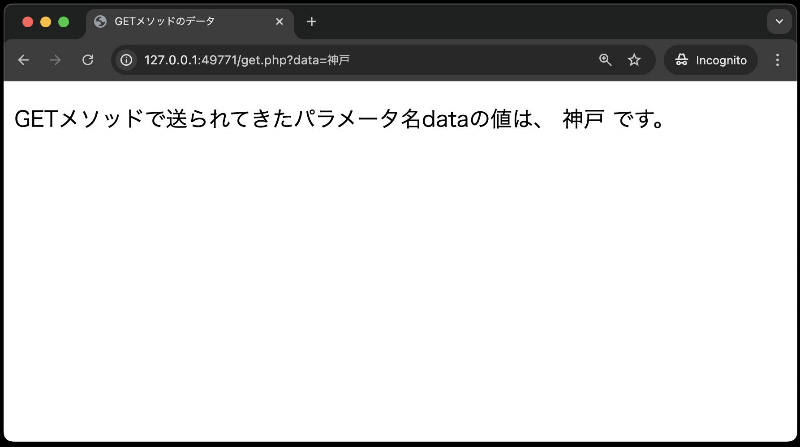
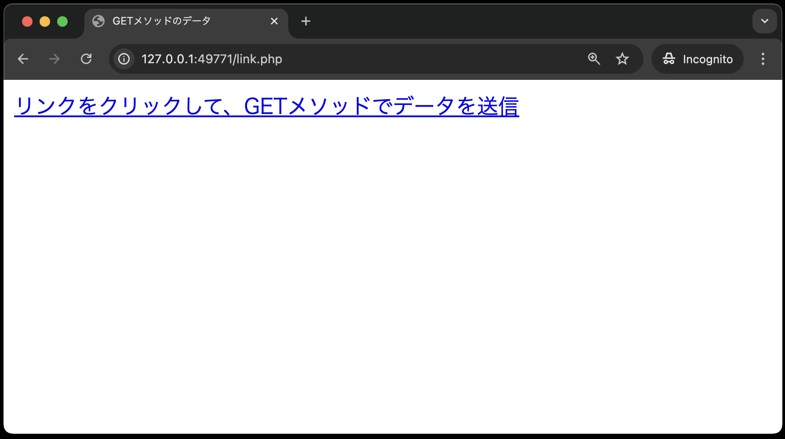
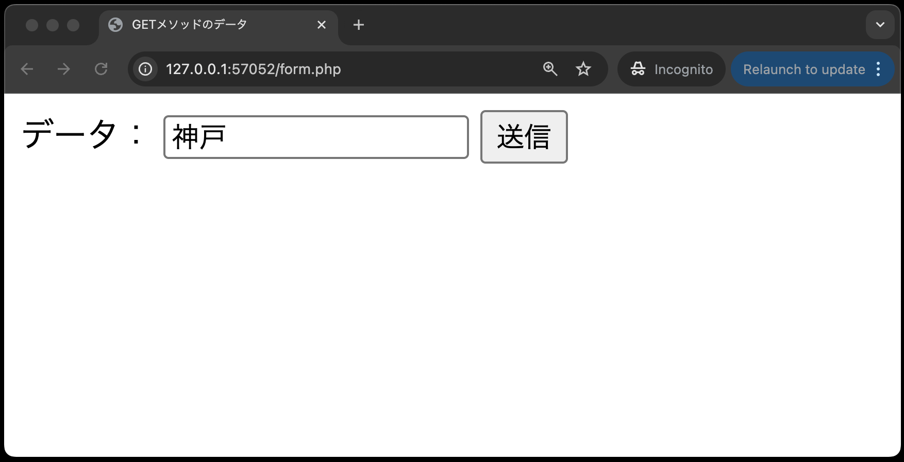
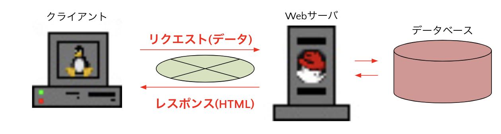

# GETメソッドでデータ送信

それでは、まずGETメソッドを使って、データを送信してみましょう。

`public`ディテクトリ内に、`get.php`ファイルを作成し、以下のコードを入力してください。<br>

**get.php**

```php
<!DOCTYPE html>
<html lang="ja">

<head>
    <meta charset="UTF-8">
    <meta name="viewport" content="width=device-width, initial-scale=1.0">
    <title>GETメソッドのデータ</title>
</head>

<body>
    <p>GETメソッドで送られてきたパラメータ名dataの値は、
        <?php
        echo $_GET['data'] . " です。</p>";
        ?>
</body>

</html>
```

`$_GET['data']`: HTTPのGETメソッドで送られてきたパラメータ名 `data` の値を受け取る処理です。
この `$_GET[ ]`は、PHPの定義済み変数の一つで、その実態は連想配列です。

この `get.php` に、ブラウザでアクセスすると、次のようなエラー画面となります。



これは、`$_GET['data']`でパラメータ名 `data` の値を受け取ろうとしているが、実際には値が送られてきていないためエラーとなっています。

GETメソッドでデータを送信するには、**クエリパラメータ** の仕組みを利用します。
具体的には、リクエストとして送信したいデータを `?パラメータ名=値` の形式で**URLの末尾**に付与します。

それでは実際に「クエリパラメータ」を利用してみましょう。<br>
先ほど、`get.php`にアクセスしたURLの末尾に、`?data=神戸` を付与し、アクセスしてみてください。
するとリクエスト時に「神戸」の値が入った`data`パラメータが送信され、以下のように表示されます。



## GETメソッドでリンクからデータ送信

次に、GETメソッドでデータを送信するためのリンクを作成してみましょう。
`public`ディレクトリ直下に、`get.php`にリンクからデータを送信するための`link.php`を作成し、以下のコードを入力してください。

```php
<!DOCTYPE html>
<html lang="ja">
<head>
    <meta charset="UTF-8">
    <meta name="viewport" content="width=device-width, initial-scale=1.0">
    <title>GETメソッドのデータ</title>
</head>
<body>
    <a href="get.php?data=神戸">リンクをクリックして、GETメソッドでデータを送信</a>
</body>
</html>
```

`link.php`をブラウザで開き、リンクをクリックしてみましょう。
すると、以下のように表示されます。




## GETメソッドでフォームからデータ送信

次に、GETメソッドでデータを送信するためのフォームを作成してみましょう。
※HTMLのフォームの種類については、次章で詳しく説明します。

`public`ディレクトリ直下に、`get.php`にフォームからデータを送信するための`form.php`を作成し、以下のコードを入力してください。

```php
<!DOCTYPE html>
<html lang="ja">
<head>
    <meta charset="UTF-8">
    <meta name="viewport" content="width=device-width, initial-scale=1.0">
    <title>GETメソッドのデータ</title>
</head>
<body>
    <form action="get.php" method="GET">
        データ：<input type="text" name="data" id="data">
        <input type="submit" value="送信">
    </form>
</body>
</html>
```

`form.php`をブラウザで開き、データを入力して送信ボタンをクリックしてみましょう。
すると、以下のように表示されます。



`form.php`の`action`属性に指定したURLに、フォームで入力したデータが送信されます。
`method`属性に指定した`GET`メソッドで、データが送信されます。

```note
### クライアントサイドとサーバーサイドの復習

今回のデータ送信について、一見するとブラウザでの画面遷移の際にデータを送信しているように見えます。
ですが実際には、以下のことが高速で行われています。

- クライアントのブラウザからサーバーへリクエストを送信する
- リクエストと同時にデータが送信され、サーバーで受け取る
- 受け取ったデータはサーバーで処理され、レスポンス(HTML)としてブラウザに返される

上記のこと踏まえ、以下の図を見ながら、処理の流れを追うことができるようにしておきましょう。



```
