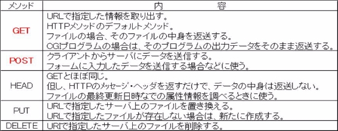

# HTTP（HyperText Transfer Protocol）

Webアプリケーションでは、クライアント（Webブラウザ）からWebサーバーへHTTPのプロトコルを使ってデータを送信しています。


HTTPの特徴は以下のとおりです。

1. クライアント/サーバモデル
2. シンプルな構造
3. オーバーヘッドが少ない
4. ステートレス （ステート：状態、レス：ない）

## HTTPのメソッド

クライアントからWebサーバへリクエスト送信時にサーバでの処理方法も併せて送信します。



## GETとPOSTの特徴


## URL （Uniform Resource Locator）

URLとは、インターネットのリソースに対する統一的な名前付けの手法です。

例えば、「はじめてのPHP」の章で作成した`hello.php`にアクセスする場合のURLは以下のようになっていました。

```text
http：//localhost(:ポート番号)/hello.php
```

上記URLもルールに則り構成されており、大きく3つの要素に分類されます。

1. スキーム(http://): <br>
   スキームには、そのリソースにたどり着くまでの手段(通信プロトコル)が含まれるます。
   よく見るものとしてはhttpや、TLS/SSLによって通信経路が暗号化されるhttpsなどがあります。<br><br>
2. ホスト名(localhost(:ポート番号)): <br>
   ホスト名には、リクエスト先のサーバの名前が入ります。ですので、今回この授業で用意されたサーバの名前は`localhost`となります。<br><br>
3. パス(/hello.php): <br>
   パスには、ホスト名で指定されたサーバーのリソースへのパスが入ります。
   ちなみに、本授業の環境では、`public`ディレクトリ直下のパスがこの部分にあたります。
