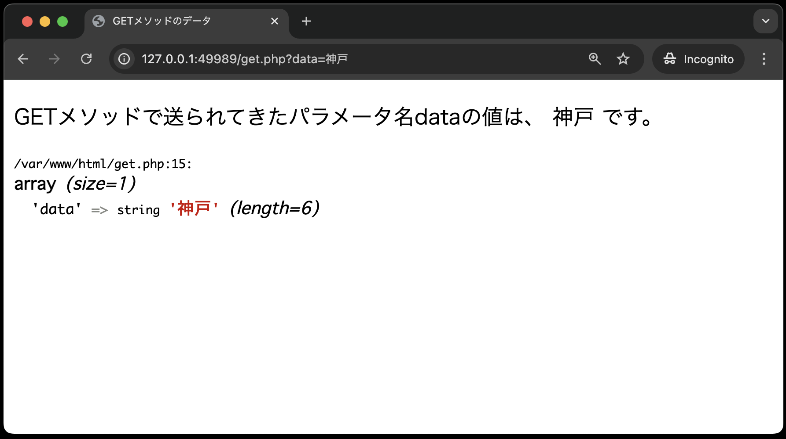

## 付録: `var_dump()`で連想配列を理解する

`var_dump()`関数は、PHPで変数のデータ型や値を出力するために使用されます。変数の値と型が出力されるため、デバッグ時に非常に役立つ関数でもあります。配列やオブジェクトなどの複雑なデータ構造を表示することもできます。

今回は、例として、クエリパラメータのデータが、連想配列形式で`$_GET[ ]`に格納されていることを `var_dump()` 関数で確認してみましょう。

`gets.php`のプログラムに、`var_dump`関数を追加します。

```php
<!DOCTYPE html>
<html lang="ja">

<head>
    <meta charset="UTF-8">
    <meta name="viewport" content="width=device-width, initial-scale=1.0">
    <title>GETメソッドのデータ</title>
</head>

<body>
    <h4><!-- ここに"出席番号 名前"を入れてください --></h4>
    GETメソッドで送られてきた複数のデータを受け取る。<br>
        <?php
        echo "出席番号:" . $_GET['course'] . $_GET['class'] . $_GET['number'] . "、氏名:" . $_GET['name'];
        
        // 下記2行を追加
        echo '</br>';
        var_dump($_GET);
        ?>
</body>

</html>
```

再度、`gets.php`にブラウザでアクセスしてみましょう。URLの末尾に、`?course=0J&class=01&number=050&name=神戸電子`を付与することも忘れずに！以下の画面が表示されるはずです。



画面下部に、`var_dump()`によって出力された`$_GET[ ]`の中身が表示されています。配列の中に4つの要素があり、「キー」と「値」のペアで格納されていることがわかります。また、`var_dump()`では、格納されている「値」の型の情報も出力されています。

このように、中身がわからない、変数や配列、オブジェクトなどを`var_dump()`で確認できます。特にデバッグ時に非常に役に立ちますので、覚えておきましょう！。

**ここまでの資料はサンプルです。本章「データ送信(HTTP-GETメソッド)」の課題はありません。**